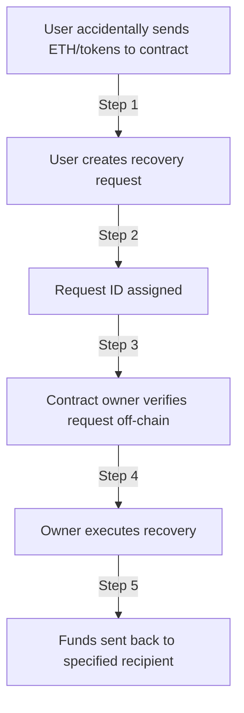
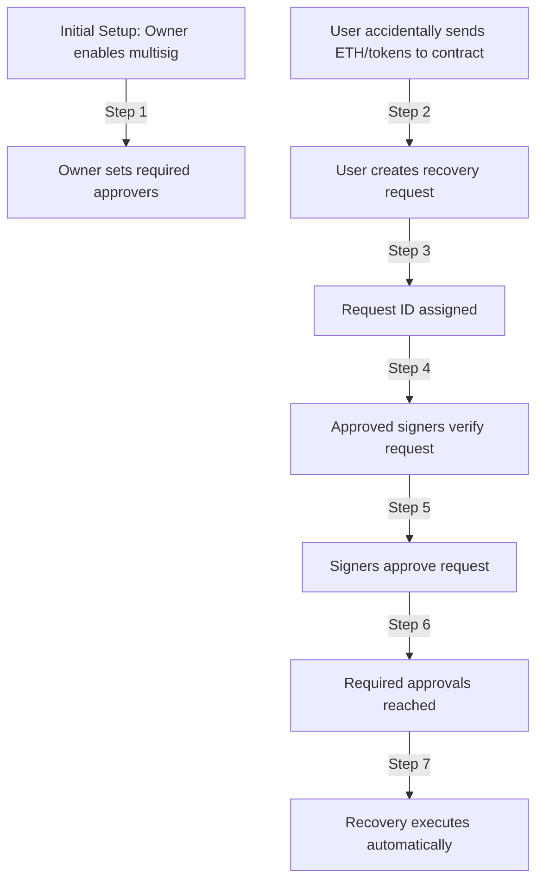

# EmergencyRecovery

A secure smart contract implementation for recovering ETH and ERC20 tokens accidentally sent to a contract address. Features a request-based recovery system with optional multisig functionality for enhanced security.

## Key Features

- ETH and ERC20 token recovery
- Request-based recovery system
- Optional multisig security
- Built-in reentrancy protection
- Event tracking for transparency
- Gas-optimized with custom errors

## Recovery Flows

### Standard Flow (No Multisig)


### Multisig Flow


## Function Guide

### Recovery Functions

```solidity
// Request ETH recovery
function requestEthRecovery(
    address recipient,
    uint256 amount
) external

// Request token recovery
function requestTokenRecovery(
    address token,
    address recipient,
    uint256 amount
) external

// Execute recovery (owner only)
function executeRecovery(uint256 requestId) external onlyOwner
```

### Multisig Functions

```solidity
// Enable multisig with specified signers
function enableMultisig(
    address[] calldata _signers,
    uint256 _requiredApprovals
) external onlyOwner

// Disable multisig functionality
function disableMultisig() external onlyOwner

// Approve a recovery request (signer only)
function approveRecovery(uint256 requestId) external
```

### View Functions

```solidity
// Get contract's ETH balance
function getEthBalance() external view returns (uint256)

// Get contract's token balance
function getTokenBalance(address token) external view returns (uint256)
```

## Integration Example

```solidity
// Import the contract
import "./EmergencyRecovery.sol";

// Create recovery request
function requestRefund() external {
    uint256 amount = 1 ether;
    recoveryContract.requestEthRecovery(msg.sender, amount);
}

// Setup multisig (optional)
function setupMultisig() external onlyOwner {
    address[] memory signers = new address[](3);
    signers[0] = address1;
    signers[1] = address2;
    signers[2] = address3;
    recoveryContract.enableMultisig(signers, 2); // 2-of-3 multisig
}
```

## Events

```solidity
event EthRecovered(address indexed requestor, address indexed to, uint256 amount);
event TokensRecovered(address indexed token, address indexed requestor, address indexed to, uint256 amount);
event RecoveryRequested(uint256 indexed requestId, address indexed requestor, address token, uint256 amount);
event RecoveryApproved(uint256 indexed requestId, address indexed signer);
event MultisigEnabled(uint256 requiredApprovals, address[] signers);
```

## Security Considerations

1. Request Verification
   - Verify transaction hashes
   - Check recipient addresses
   - Confirm amounts match

2. Multisig Best Practices
   - Use different devices/locations for signers
   - Implement proper off-chain coordination
   - Regular signer rotation recommended

3. Technical Safety
   - Reentrancy protection built-in
   - Zero address checks
   - Balance verification
   - Duplicate approval prevention

## Usage Example

1. User accidentally sends ETH:
```solidity
// User requests recovery
uint256 amount = 1 ether;
recoveryContract.requestEthRecovery(
    recipient,  // Address to receive recovered funds
    amount      // Amount to recover
);

// Request ID is emitted in RecoveryRequested event
```

2. Owner/Signers verify (off-chain):
- Check transaction hash
- Verify amount matches
- Confirm recipient

3. Execute Recovery:
```solidity
// Without multisig (owner)
recoveryContract.executeRecovery(requestId);

// With multisig (signers)
recoveryContract.approveRecovery(requestId);
```

## Error Codes

```solidity
error ZeroAddress();          // Invalid address provided
error ZeroAmount();           // Amount must be greater than 0
error TransferFailed();       // Transfer operation failed
error InsufficientBalance();  // Not enough balance
error InvalidSignersCount();  // Invalid multisig configuration
error SignerAlreadyApproved(); // Duplicate approval
error NotApprovedSigner();    // Unauthorized signer
error RecoveryNotRequested(); // Invalid request ID
error MultisigNotEnabled();   // Multisig not configured
```

## License

MIT